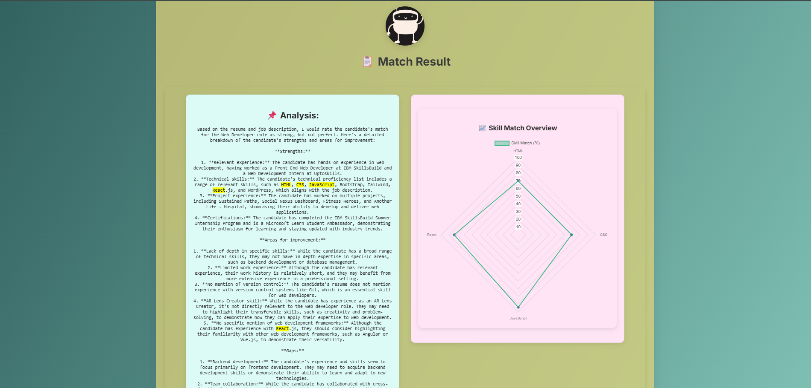
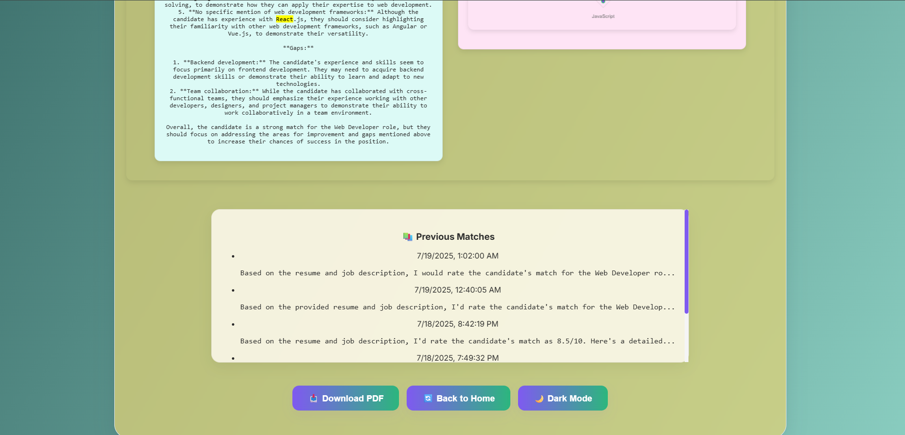

# 🎯 Career Compass – Smart Resume & Job Match Analyzer

**Career Compass** is a smart web app that analyzes your resume against a job description using AI. It tells you how well your resume matches the job, shows relevant skills, highlights keywords, and gives you suggestions to improve your job fit!

Built using **React**, **FastAPI**, **OpenAI**, and modern UI libraries.

---

## 🚀 Features

- 📂 Upload your resume (.pdf or .txt)
- 📝 Paste any job description
- ⚡ One-click AI-powered match analysis
- 🧠 Extracted key skills from both resume and JD
- 📊 Skill match radar chart (visual representation)
- 🧩 Keyword highlighting in the analysis
- 💾 Save last 5 results in local history (via localStorage)
- 🌗 Dark Mode toggle
- 🧲 Drag & Drop resume upload support
- 📄 Download result as PDF

---

## 📸 Screenshots

| Upload Page | Result Page |
|-------------|-------------|
|  | | | 

---

## 🛠️ Tech Stack

| Frontend           | Backend           | AI / NLP           |
|--------------------|-------------------|--------------------|
| React + Vite       | FastAPI (Python)  | OpenAI GPT-3.5/4   |
| TailwindCSS        | PyPDF2            | Regex + Prompting  |
| Lottie Animations  | CORS Middleware   | Custom Parsers     |

---

## 📂 Folder Structure

```bash
career-compass/
├── backend/               # FastAPI backend
│   └── main.py            # Resume & JD analyzer
├── frontend/              # React frontend
│   ├── public/
│   │   └── lottie/        # Lottie animations
│   ├── src/
│   │   ├── components/    # SkillChart, MatchHistory, etc.
│   │   ├── utils/         # Parsing logic
│   │   ├── App.jsx
│   │   ├── Home.jsx
│   │   └── MatchResult.jsx
└── README.md

## 🔧 Getting Started (Run Locally)

### 1. Backend (FastAPI)

```bash
cd backend
pip install -r requirements.txt
uvicorn main:app --reload

### 1. Frontend (React + Vite)

cd frontend
npm install
npm run dev

🔗 Live Demo
<!-- 👉 [Check it Live](https://your-live-link.vercel.app) -->

## 📃 License

This project is for educational/demo purposes only.

## 🙌 Credits

Built with ❤️ using:
- React + Vite
- FastAPI + PyPDF2
- OpenAI GPT
- TailwindCSS + Lottie + Chart.js


